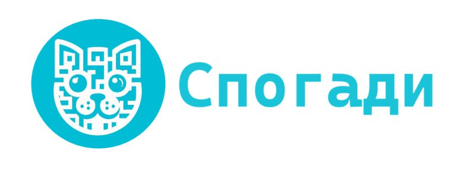

## Hi there, I'm Andrew from Ukraine 👋

🎯 I'm **co-founder** and **full-stack** engineer @ [Spohady](https://www.spohady.com/). I have a great experience in e-commerce and data storage domains. Also, I am passionate about Azure, I obtain a lot of experience with Azure App Services, Blob Storage, Azure AI tools.

🚀 My mission is to provide **engineering excellence** focused on proper architecture and the best agile practices, delivering high-quality products, working closely with customers and developing software products on different platforms.

💬 Ask me about Software Architecture, Cloud computing (Azure), C#/.NET, Databases, DevOps, Agile methods, People, Coaching, Organizations, Productivity. 

📫 How to reach me:

* Email: andrii.yavorovskyi@gmail.com
* LinkedIn: [yavandrii](https://www.linkedin.com/in/yavandrii/)
* Telegram: @yavandrii

